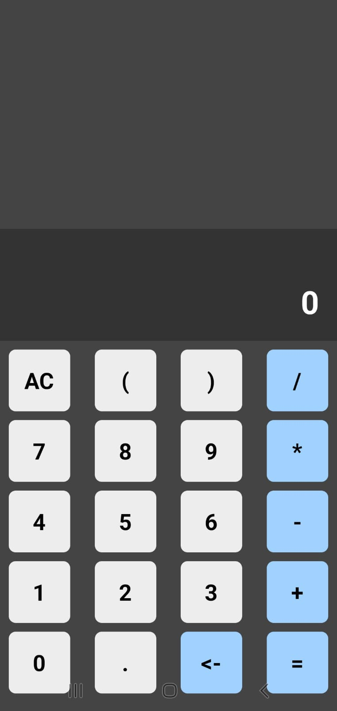

# 🧮 Calculadora em React Native

Aplicativo de calculadora desenvolvido em **React Native** com **TypeScript**, utilizando o **Expo** para execução. Ele possui uma interface simples e funcional com suporte a expressões matemáticas básicas.

## 📱 Captura de Tela

<p align="center">
  
</p>


## 🚀 Funcionalidades

- Digitação de expressões matemáticas com parênteses.
- Cálculo de resultado utilizando `eval()` (seguro neste contexto).
- Limpar toda a expressão (`AC`) ou apagar um caractere (`<-`).
- Layout dividido entre **Display** e **Teclado**.
- Navegação amigável para dispositivos móveis.

---

## 🛠️ Tecnologias utilizadas

- [React Native](https://reactnative.dev/)
- [TypeScript](https://www.typescriptlang.org/)
- [Expo](https://expo.dev/)
- Componentes personalizados com `TouchableHighlight` e `StyleSheet`

---

## 📂 Estrutura do projeto

```

calculadora-app/
├── components/
│ ├── Display.tsx # Componente do display (expressão + resultado)
│ └── Tecla.tsx # Componente de botão
├── App.tsx # Componente principal
├── assets/ # Imagens
└── README.md
```

---

## 🧠 Lógica do App

- O estado da aplicação (expressão digitada e resultado) é controlado no componente `App.tsx`.
- O botão `=` aciona o `eval()` sobre a string da expressão.
- Cada tecla do teclado é um componente `Tecla`, que chama a função `TeclaPressionada` ao ser clicada.
- O `Display` mostra a expressão digitada na parte superior e o resultado logo abaixo.

---

## ▶️ Como executar

1. Clone o repositório:

```
git clone https://github.com/thfields/calculadora-app.git
cd calculadora-app
```
2. Instalar as dependências:

```
npm install
```

3. Executar o projeto:

```
npm start
```

## 👨‍💻 Autores
- Thiago Campos
- Paulo Vieira
